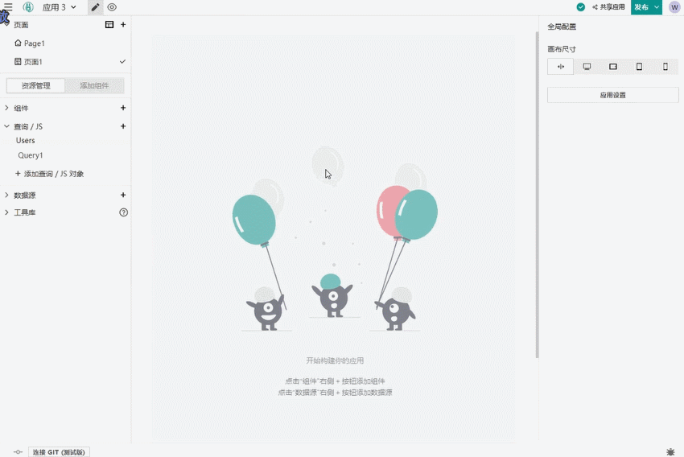
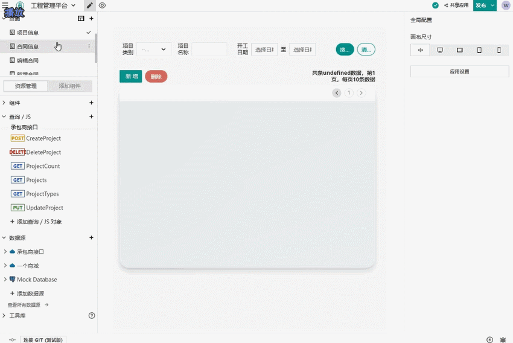
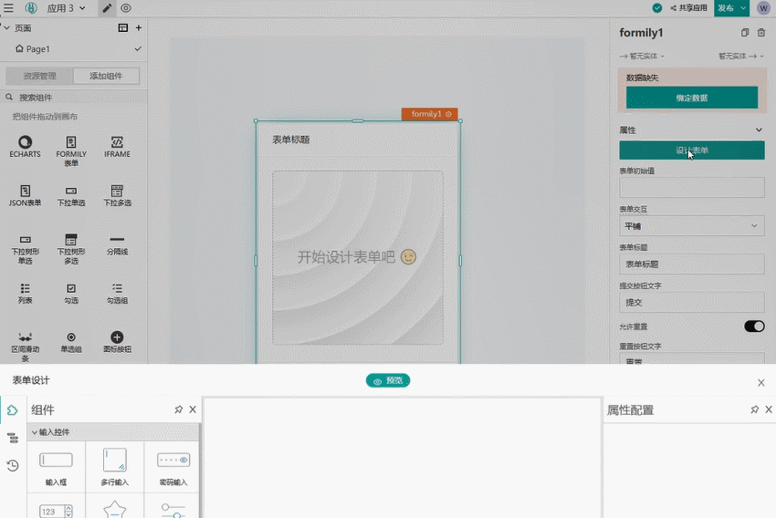
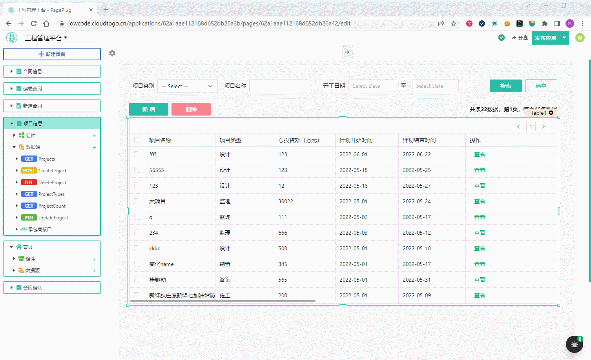

<p align="center">
  
</p>

<h2 align="center">更快、更快乐的开源前端低代码【中国版Appsmith】</h2>

<h3 align="center" style="margin-bottom: 32px">
  <a href="#quickStart">快速开始</a>
  •
  <a href="#help">帮助</a>
  •
  <a href="https://appsmith-fans.cn/" target="_blank">中文社区</a>
</h3>

## PagePlug 是什么？
PagePlug 是 [Appsmith](https://github.com/appsmithorg/appsmith) 的超集，是一个更适合中国开发者的开源前端低代码平台，可以用来制作 web 应用、微信小程序。适合有基础开发经验的开发者：程序员、运维工程师、计算机类师生、数据分析师、产品经理等。

> 当前版本基于 Appsmith v1.7.14 版本，最新版本正在开发中，敬请期待。

## PagePlug 和其他低代码有什么不同？
PagePlug 无需侵入客户架构，直接连接数据源（API、DB），任何的后端数据都变成了 JS 变量，可以随意转换、并配置到任意的视图组件，整个过程符合开发者心流，前端开发变得不仅更快了、而且更快乐了！

<p>
  
</p>

<p>
  
</p>

## 功能特色

- 支持移动端！一分钟制作一个小程序，并生成小程序码进行分享！
  

- 丰富的移动端组件
  

- 集成社区中功能拔群的表单解决方案 [Formily](https://github.com/alibaba/formily)
  

- PC端应用支持自定义导航菜单
  

- 中文界面、更简洁的 UI

- 引入 antd 组件库，react 版本升级到 v17

- 简化启动步骤，支持Windows环境本地开发（无需WSL）  
  官方 AppSmith 前端项目第一次启动步骤繁琐，依赖非常多，并且官方支持 Windows 平台本地开发是通过 WSL 实现的，配置非常麻烦！PagePlug 优化了 Windows 环境下的运行脚本，简化了项目启动过程。[详请](#dev)


## DEMO 项目
- 严选小程序（微信小程序）  
  

  PagePlug 制作的完整电商小程序案例，支持注册、登录、二级商品分类、商品搜索、商品详情、购物车、购买下单、收货地址管理、订单管理等功能。后端接口使用开源后台 [litmall](https://github.com/linlinjava/litemall) 的一个部署实例

- 工程管理系统（PC web应用）  
  [体验地址](https://lowcode.methodot.com/applications/62a1aae112168d652db26a3b/pages/62a1aae112168d652db26a47)  
  PagePlug 制作的一个典型CRUD项目，实现了基本增删改查、后端分页、搜索过滤、弹窗表单、复杂表单等功能

<div id="quickStart" />

## 快速开始
- 🚀 [立即体验](https://lowcode.methodot.com)（可使用任意邮箱注册登录）  
  > **注意**：体验环境数据没有做持久化，只作功能演示使用，如果需要长期使用，请使用我们推荐的SaaS版本  

- 🌈 稳定SaaS版本，Methodot（推荐）  
  [https://methodot.com](https://methodot.com)  
  Methodot 是一站式云原生在线开发协作平台，它通过独创的在线应用架构图，深度集成了 PagePlug 的前端低代码功能，还支持通过 WebIDE 进行传统方式的应用开发，实现了 procode + lowcode 的深度结合，一键编译、构建、发布、运维你的应用。

- 🌱 私有部署【Docker】（推荐）  
  > 最低服务器配置：4G内存 + 2核CPU
  ```
  // 获取安装脚本
  curl -O https://raw.githubusercontent.com/cloudtogo/pageplug/open/install.sh

  // 赋予运行权限
  chmod +x install.sh

  // 执行安装脚本
  ./install.sh
  ```

<div id="dev" />

### 🎈 本地开发
PagePlug 代码位于 /app 目录下，主要目录分别是：
- /client -- React 前端项目，使用 create-react-app 脚手架生成，负责低代码的编辑器和 web 端展示
- /server -- Java 后端项目，使用 Spring WebFlux 框架，负责低代码的后端服务、各种数据源的代理
- /taro -- Taro 移动端项目，使用 Taro 跨平台方案实现移动端对低代码 DSL 的解析和展示

#### PagePlug 前端启动
PagePlug 前端项目使用 Nginx 作为网关，并且 Nginx 使用 Docker 运行，所以在运行之前请确保已安装 [Docker](https://www.docker.com/get-started/) ，下面的启动命令仅针对 **Windows** 环境，非Windows环境请参考[官方指南](/contributions/ClientSetup.md)。
```
// 配置 host
127.0.0.1 dev.appsmith.com

// 环境变量
cp .env.example .env

// 启动本地 nginx docker
cd app/client
yarn start-proxy

// 启动前端服务
yarn
yarn start-win
```
顺利启动后，访问 [https://dev.appsmith.com](https://dev.appsmith.com/) 预览效果。

#### PagePlug 后端启动
PagePlug 后端启动需要 Jdk11、Maven3、一个Mongo实例和一个Redis实例，具体操作请参考[官方指南](/contributions/ServerSetup.md)。下面的启动命令仅针对 **Windows** 环境，Windows环境运行脚本需要借助 bash 命令，非 Windows 环境下直接运行脚本即可。  
> **注意**：build.sh 脚本中用到了 rsync 工具，启动前请确保系统中已经安装了 rsync，Windows环境安装 rsync 请看[这里](https://xindot.com/2019/08/13/add-rsync-to-git-bash-for-windows/)。
```
// 使用 IDEA 打开工程
app/server

// 创建环境变量文件
cp envs/dev.env.example .env

// 打开.env，配置环境变量
APPSMITH_MONGODB_URI="你的Mongo实例地址"
APPSMITH_REDIS_URL="你的Redis实例地址"

// 构建 java 服务
mvn clean compile
bash ./build.sh -DskipTests

// 启动 java 服务
bash ./scripts/start-dev-server.sh
```

#### PagePlug 移动端启动
PagePlug 移动端是一个 [Taro](https://github.com/NervJS/taro) 项目，天然地支持多端小程序、H5和React Native，但是，目前 PagePlug 仅支持微信小程序，微信小程序的预览和发布需要使用微信开发者工具、小程序账号，开发前请先查看[微信小程序官方指南](https://developers.weixin.qq.com/miniprogram/dev/framework/quickstart/getstart.html)。  
PagePlug 移动端组件采用 [Taroify](https://github.com/mallfoundry/taroify) UI组件库打造。
```
cd app/taro

打开 config/dev.js 配置开发参数

// PagePlug 后端接口地址，本地开发时需要填写本机IP地址
API_BASE_URL: '"http://192.168.xxx.xxx:8080/api/"'

// 小程序默认展示的应用ID，你可以从应用的url中找到应用ID：/app/[应用ID]/page/[页面ID]
DEFAULT_APP: '"应用ID"'

// 启动 Taro 项目
yarn
yarn dev:weapp
```


<div id="help" />

## 帮助
- 扫码邀请加入微信交流群  
  
- [中文社区](https://appsmith-fans.cn/)

## 贡献者
[AppSmith团队](https://github.com/appsmithorg/appsmith)、[王昆](https://github.com/lifeneedspassion)

## 感谢这些巨人
PagePlug 代码中使用到的才华横溢的开源项目，感谢这些开源项目让世界更美好！
- [AppSmith](https://github.com/appsmithorg/appsmith)（低代码原型）
- [Taro](https://github.com/NervJS/taro)（移动端跨端解决方案）
- [Formily](https://github.com/alibaba/formily)（表单解决方案）
- [Taroify](https://github.com/mallfoundry/taroify)（Taro UI组件库）
- [React Vant](https://github.com/3lang3/react-vant)（React版Vant组件库）

## LICENSE
本项目基于 [Apache License 2.0](/LICENSE) 开源协议
