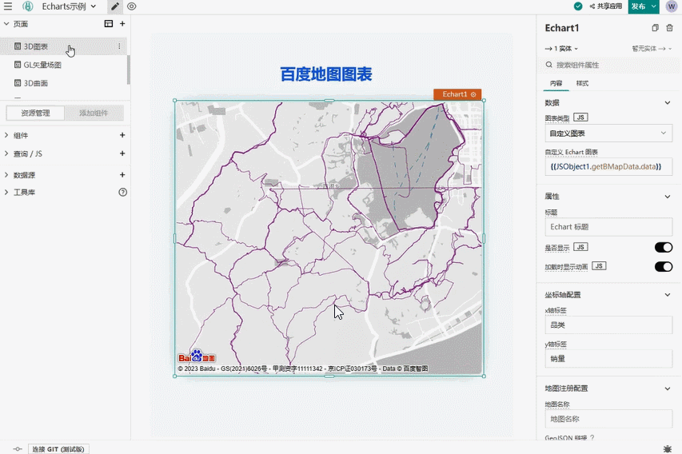
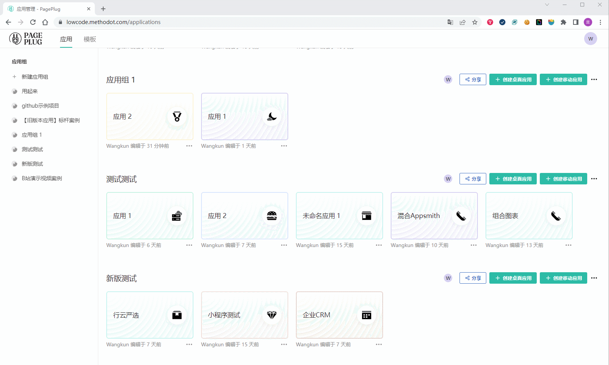

<p align="center">
  
</p>

<h2 align="center">面向研发使用的低代码，让智慧的开发者们不再做重复的造轮子工作

  专注于创新、创造业务价值
</h2>

<h3 align="center" style="margin-bottom: 32px">
  <a href="#quickStart">快速开始</a>
  •
  <a href="#help">帮助</a>
  •
  <a href="https://appsmith-fans.cn/" target="_blank">中文社区</a>
</h3>

## PagePlug 是什么？
PagePlug 是 [Appsmith](https://github.com/appsmithorg/appsmith) 的中国化项目，是一个开源的、声明式的、可视化的前端低代码框架，可以用来制作 web 应用、微信小程序。

> 当前版本基于 Appsmith v1.9.20 版本，最新版本正在开发中，敬请期待。

记得在github上给开源的大佬们点个星星🌟支持下哦～～

## PagePlug 和其他低代码有什么不同？
PagePlug与市面上其他的低代码（轻流、宜搭、微搭、简道云、轻流、活字格等等）面向的使用人群不同，后者更倾向于非编程人员使用，让业务线人员自行构建应用程序。而PagePlug这款低代码产品是面向To D研发人群使用的，它旨在加速开发人员的开发过程，内部系统、工具的开发更简单。

虽然PagePlug与其他无代码、低代码平台一样都是为了让人们更轻松地创建应用程序和自动化流程，但其支持API和数据管理功能的强大和灵活性更高，无需侵入客户架构，直接连接数据源（API、DB），任何的后端数据都变成了 JS 变量，可以随意转换、并配置到任意的视图组件。因此对于需要更高度定制和更广泛的操作的用户，PagePlug可能是更好的选择。
<p>
  
</p>

<p>
  
</p>

## 功能特色

- 更强大的可视化建模工具

PagePlug拥有非常直观和灵活的可视化建模工具，如表格、图表、表单、按钮等。这些组件都是经过优化和测试的，可以满足大多数业务需求，从而减少开发人员的工作量，避免大量的编码工作和测试工作。可以让开发人员根据需要更容易地拖放和配置各种组件，创建自定义表单、报告和应用程序，无需重复编写复杂的代码，而且整个软件的维护更加轻便
  

- 更广泛的API支持

PagePlug支持大量的第三方API集成，包括数据存储、消息队列、文件上传等，可以让开发人员更轻松地集成各种功能，可以与自己的应用程序进行无缝集成，扩展应用程序的功能。
  


- 更完善的数据管理功能

PagePlug提供了强大的数据管理工具，让用户可以轻松地编写和执行SQL查询语句，管理数据库、表格以及其他数据资源。相较于其他低代码平台，PagePlug连接api及数据库服务器无需手动配置，内置引擎充分支持。
  
  
- 更强大的扩展性

PagePlug支持任意一处使用JavaScript编写自定义代码，目前也支持添加第三方JS库，可以方便地自定义组件和控制逻辑，从而更好地实现个性化需求
  
  
- 更好的安全性支持

PagePlug提供很多针对安全性的支持，包括身份验证、授权、加密、审计等，可以保证你的应用程序安全可靠。
  
## 与Appsmith的不同  

- 基于Appsmith做了整体汉化及性能优化，体验变得更好了

简化启动步骤，支持Windows环境本地开发（无需WSL），官方AppSmith前端项目第一次启动步骤繁琐，依赖非常多，并且官方支持 Windows 平台本地开发是通过 WSL 实现的，配置非常麻烦！

- 引入 antd 组件库，支持Antd5，react 版本升级到 v17

- 丰富的移动端组件 ，支持移动端！一分钟制作一个小程序，并生成小程序码进行分享！

  

- 更快捷简单的图表解决方案： [Echarts](https://echarts.apache.org)  

  
  

- 集成表单解决方案领域的佼佼者： [Formily](https://github.com/alibaba/formily)

  
  


## DEMO 项目
- 严选小程序（微信小程序）  
  
  
（因小程序版本升级，目前旧的二维码使用会报错，待大版本更新后微信端可正常使用），可先在pc端体验感受：[体验地址](https://lowcode.methodot.com/applications/640042ebde5d5825c7acfd91/pages/640042ebde5d5825c7acfdae/?hmsr=G1&hmpl=A3)

  PagePlug 制作的完整电商小程序案例，支持注册、登录、二级商品分类、商品搜索、商品详情、购物车、购买下单、收货地址管理、订单管理等功能。后端接口使用开源商城后台 [litmall](https://github.com/linlinjava/litemall) 

- 工程管理系统（PC web应用）  
  [体验地址](https://lowcode.methodot.com/applications/6322a1453892ca140cb874d5/pages/6322a1453892ca140cb874e3/?hmsr=G1&hmpl=A2)  
  PagePlug 制作的一个典型CRUD项目，实现了基本增删改查、后端分页、搜索过滤、弹窗表单、复杂表单等功能

- 企业CRM系统（PC web应用）  
  [体验地址](https://lowcode.methodot.com/applications/6322a6d63892ca140cb87551/pages/6322a6d63892ca140cb87555?embed=1/?hmsr=G1&hmpl=A1)  
  PagePlug 制作的简单CRM项目，实现了线索、商机和客户的信息管理

- Echarts示例  
  演示如何在 PagePlug 中使用 Echarts

## 如何导入 DEMO 项目？
通过文件方式导入demo项目到应用组，demo项目 JSON 文件在 /demo 目录下



<div id="quickStart" />

## 快速开始
- 🚀 [立即体验](https://lowcode.methodot.com)  
  > **注意**：体验环境数据没有做持久化，只作功能演示使用

- 🌱 [私有部署【Docker】](https://lowcode.methodot.com/app/pageplug/page1-63160074cb370d532de7f2af?embed=1)（推荐）  
  > 最低服务器配置：4G内存 + 2核CPU

- 🤩[详细安装文档教程](https://docs.pageplug.cn/xue-xi-wen-dang/bu-shu-an-zhuang/yuan-ma-ben-di-hua-bu-shu-windows-ban/?hmsr=G1&hmpl=A4)
  > 有问题可添加下方静静二维码，加入社区讨论学习

<div id="dev" />

### 🎈 本地开发

PagePlug 代码位于 /app 目录下，主要目录分别是：
- /client -- React 前端项目，使用 create-react-app 脚手架生成，负责低代码的编辑器和 web 端展示
- /server -- Java 后端项目，使用 Spring WebFlux 框架，负责低代码的后端服务、各种数据源的代理
- /taro -- Taro 移动端项目，使用 Taro 跨平台方案实现移动端对低代码 DSL 的解析和展示

#### PagePlug 前端启动
PagePlug 前端项目使用 Nginx 作为网关，并且 Nginx 使用 Docker 运行，所以在运行之前请确保已安装 [Docker](https://www.docker.com/get-started/) ，下面的启动命令仅针对 **Windows** 环境，非Windows环境请参考[官方指南](/contributions/ClientSetup.md)。
```
// 配置 host
127.0.0.1 dev.appsmith.com

// 环境变量
cp .env.example .env

// 启动本地 nginx docker
cd app/client
yarn start-proxy

// 启动前端服务
yarn
yarn start-win
```
顺利启动后，访问 [https://dev.appsmith.com](https://dev.appsmith.com/) 预览效果。

#### PagePlug 后端启动
PagePlug 后端启动需要 Jdk11、Maven3、一个Mongo实例和一个Redis实例，具体操作请参考[官方指南](/contributions/ServerSetup.md)。下面的启动命令仅针对 **Windows** 环境，Windows环境运行脚本需要借助 bash 命令，非 Windows 环境下直接运行脚本即可。  
> **注意**：build.sh 脚本中用到了 rsync 工具，启动前请确保系统中已经安装了 rsync，Windows环境安装 rsync 请看[这里](https://xindot.com/2019/08/13/add-rsync-to-git-bash-for-windows/)。
```
// 使用 IDEA 打开工程
app/server

// 创建环境变量文件
cp envs/dev.env.example .env

// 打开.env，配置环境变量
APPSMITH_MONGODB_URI="你的Mongo实例地址"
APPSMITH_REDIS_URL="你的Redis实例地址"

//【可选】如果需要小程序预览功能，需要配置你的小程序信息
CLOUDOS_WECHAT_APPID=""
CLOUDOS_WECHAT_SECRET=""

// 构建 java 服务
mvn clean compile
bash ./build.sh -DskipTests

// 启动 java 服务
bash ./scripts/start-dev-server.sh
```

#### PagePlug 移动端启动
PagePlug 移动端是一个 [Taro](https://github.com/NervJS/taro) 项目，天然地支持多端小程序、H5和React Native，但是，目前 PagePlug 仅支持微信小程序，微信小程序的预览和发布需要使用微信开发者工具、小程序账号，开发前请先查看[微信小程序官方指南](https://developers.weixin.qq.com/miniprogram/dev/framework/quickstart/getstart.html)。  
PagePlug 移动端组件采用 [Taroify](https://github.com/mallfoundry/taroify) UI组件库打造。
```
cd app/taro

打开 config/dev.js 配置开发参数

// PagePlug 后端接口地址，本地开发时需要填写本机IP地址
API_BASE_URL: '"http://192.168.xxx.xxx:8080/api/"'

// 小程序默认展示的应用ID
DEFAULT_APP: '"应用ID"'

// 启动 Taro 项目
yarn
yarn dev:weapp
```


<div id="help" />

## 如何贡献

如果想参与项目贡献及了解，可以阅读PP的贡献指南

- 查看社区的想法及任务——[社区任务文档](https://docs.pageplug.cn/jie-shao/jia-ru-wo-men/she-qu-ren-wu)
- 产品有更好的优化——[提交PR文档](https://docs.pageplug.cn/jie-shao/jia-ru-wo-men/ti-jiao-pull-request)
- 探讨产品的使用及想法问题——[提交issue文档](https://docs.pageplug.cn/jie-shao/jia-ru-wo-men/ti-jiao-issue)
- 部署安装遇到问题或者想加入社区交流学习、或者是对社区有其他的想法参与等等，扫描下方二维码联系PagePlug产品静静获取帮助 （目前1——7群已满，联系静静加入8群）


  


## 社区的杰出贡献者们
我们对PagePlug有更远的目标及期望，我们非常欢迎开发者们为PagePlug开源贡献一份力量，相应也将给予贡献者激励以表认可与感谢。如果你对PagePlug有更多的想法，欢迎在PP社区中寻找你志同道合的伙伴一起尝试。[社区介绍及成长路线](https://docs.pageplug.cn/jie-shao/jia-ru-wo-men)

PP Contributor：Catsoft、无名、茂行、Nina、洪涛、东哥隆咚锵

PP Committer：xiaolu

PP Maintainer：平头哥、kate、Bob

PP Team Leader：QC、DD(Owner)、Chris、克力

## 感谢这些巨人
PagePlug 代码中使用到的才华横溢的开源项目，感谢这些开源项目让世界更美好！
- [Appsmith](https://github.com/appsmithorg/appsmith)（低代码原型）
- [Taro](https://github.com/NervJS/taro)（移动端跨端解决方案）
- [Formily](https://github.com/alibaba/formily)（表单解决方案）
- [Taroify](https://github.com/mallfoundry/taroify)（Taro UI组件库）
- [React Vant](https://github.com/3lang3/react-vant)（React版Vant组件库）

## LICENSE
本项目基于 [Apache License 2.0](/LICENSE) 开源协议
